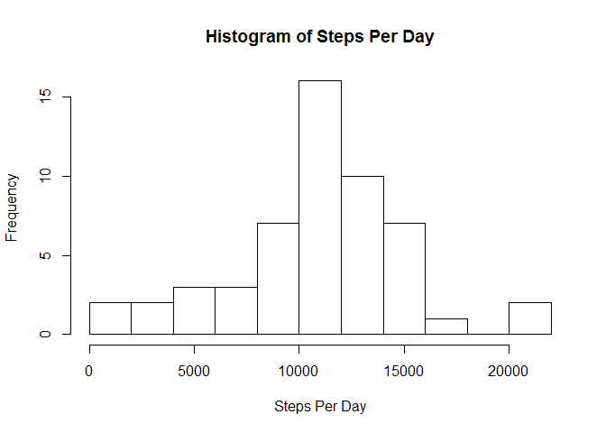
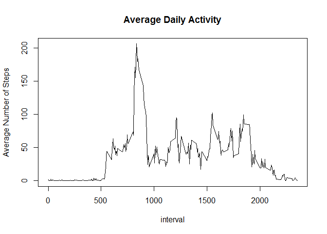
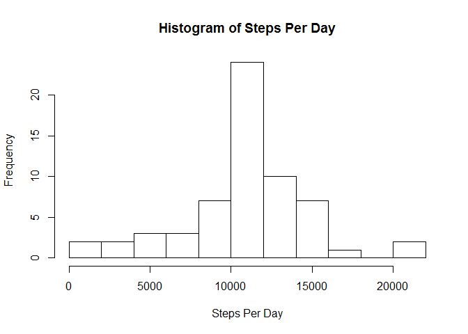
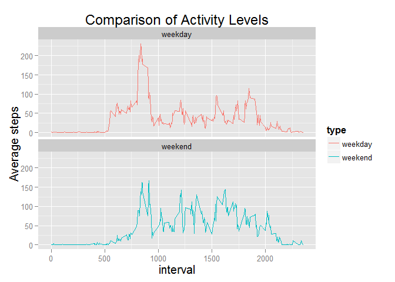

# Reproducible Research Assignment 1
Paul Chrisman  
Friday, May 15, 2015  
*********

First we will load the packages necessary for our analysis.


```r
library(dplyr)
library(ggplot2)
library(lubridate)
```

Next we will read in the data, as well as transform the date field into a POSIXct datatype.


```r
activity <- read.csv("~/R programming/activity.csv", header = TRUE, stringsAsFactors = FALSE)
activity <- mutate(activity, date = ymd(date))
```
**********
## What is the mean total number of steps taken per day?

First we will calculate the total number of steps taken per day (for this section we are ignoring the missing values in the data).


```r
steps_per_day <- aggregate(steps ~ date, data = activity, FUN = "sum")
```

Next we will make a histogram of the number of steps per day.

```r
with(steps_per_day, hist(steps, breaks = 10, main = "Histogram of Steps Per Day", xlab = "Steps Per Day"))
```

 

Finally for this section we will calculate the mean and median for total steps per day.


```r
with(steps_per_day, mean(steps))
```

```
## [1] 10766.19
```

```r
with(steps_per_day, median(steps))
```

```
## [1] 10765
```
*********
## What is the average daily activity pattern?

First we will calculate the average number of steps taken for each time interval, across all the days.  After that we will plot the results.


```r
average_daily <- aggregate(steps ~ interval, data = activity, FUN = "mean")
with(average_daily, plot(interval, steps, type = "l", ylab = "Average Number of Steps", main = "Average Daily Activity"))
```

 

Next we will determine which interval, on average, had the most activity.

```r
average_daily[which(average_daily$steps == max(average_daily$steps)),1]
```

```
## [1] 835
```

As we can see the interval with the most activity on average was 835.

**********

## Imputing missing values

There are a number of intervals with missing step counts.  First we will calculate the total number of missing values.


```r
sum(is.na(activity$steps)*1)
```

```
## [1] 2304
```

Next we have to decide on a strategy for filling in the missing values.  We will fill each missing value in with the average value for that interval.  We will now calculate a new data set with missing values filled in with the average for that interval.


```r
activity_filled <- activity
for (i in 1:nrow(activity_filled)) {
    if (is.na(activity_filled$steps[i])){
        activity_filled$steps[i] <- average_daily[which(average_daily$interval == activity_filled[i,"interval"]),2]
    }
}
```

We can now check and see that there are no NA's left in the new data set.

```r
sum(is.na(activity_filled$steps)*1)
```

```
## [1] 0
```

Now that we have filled in the missing values we can recalculate the total steps for each day and construct a new histogram.

```r
filled_totals <- aggregate(steps ~ date, data = activity_filled, FUN = "sum")
with(filled_totals, hist(steps, breaks = 10, main = "Histogram of Steps Per Day", xlab = "Steps Per Day"))
```

 

And we can also recalculate the mean and median values for steps per day.

```r
with(filled_totals, mean(steps))
```

```
## [1] 10766.19
```

```r
with(filled_totals, median(steps))
```

```
## [1] 10766.19
```

We can see that the value calculated for the mean is the same as the one we calculated earlier, while the median is only slightly altered.  So in this case, as a consequence of the way we imputed the missing values, there is not a large change in the results.

**********

## Are there differences in activity patterns between weekdays and weekends?

Now we will determine if there are differences in the acitivity pattern for weekdays and weekends.  To do this we will first calculate what day of the week each date is, and then use that info to create a new factor variable that specifies each day as a weekday or a weekend.  We will continue to use the data set with the filled in values.


```r
activity_filled <- mutate(activity_filled, Day = weekdays(date))
day_type <- vector("character", nrow(activity_filled))
for (i in 1:nrow(activity_filled)){
    if (activity_filled[i,"Day"]=="Saturday"){day_type[i] <- "weekend"}
    else if (activity_filled[i,"Day"]=="Sunday"){day_type[i] <- "weekend"}
    else {day_type[i] <- "weekday"}
}
day_type <- factor(day_type)
activity_filled <- mutate(activity_filled, type = day_type)
```

Now that we have created the variable we will calculate the averages for steps in each interval for weekdays and weekends, and then we will plot the results.

```r
weekend_comparison <- aggregate(steps ~ interval + type, data = activity_filled, FUN = "mean")
g <- ggplot(data = weekend_comparison) + geom_line(aes(x = interval, y = steps, colour = type)) + facet_wrap(~ type, ncol = 1)
g <- g + ylab("Average steps") + ggtitle("Comparison of Activity Levels")
g <- g + theme(title = element_text(size = 15))
g
```

 

It appeats that there are some differences between weekday and weekend activity.  In general activity starts much earlier on weekdays (in the 500 intervals, as opposed to the 800 intervals for the weekends).  It also seems like the general activity level is higher throughout the day on the weekend, with step counts regularly exceededing 50, while they only sporadically exceed 50 during the midday on weekdays.
